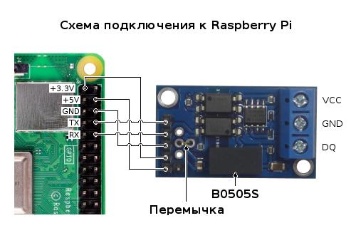

# RPI5

Based on https://arduino.ua/prod4832-master-shini-1-wire-s-galvanicheskoi-razvyazkoi-sdelano-v-ykraine (http://honey.com.ua/master/)



## Notes

Wasn't observed but the docs suggests disabling Bluetooth in `/boot/firmware/config.txt`.

```txt
dtoverlay=disable-bt
```
